# Seasonal Points Prediction Model

*Automatic Champion — Use Case 1 (Build Initial Squad)*

---

## 1. What this model does

We trained four small machine-learning models to predict how many fantasy points each Premier League player will score across a whole season. There is one model per outfield position — goalkeeper, defender, midfielder, forward — because the way each position earns points is very different. A goalkeeper picks up points mostly from clean sheets and saves; a forward picks up points mostly from goals and assists. Trying to learn all of that with one model would force it to compromise. Once a player has a predicted season total, our squad-building algorithm can compare any two players on an equal footing and choose the combination of fifteen players that maximises predicted points under the official Fantasy Premier League rules (a £100m budget, a maximum of three players from the same club, and exact position counts).

---

## 2. The data

The models are trained on six full Premier League seasons, from 2019-20 to 2024-25, exported from the official Fantasy Premier League public dataset. Each season is one row per player and contains end-of-season totals (points, minutes, goals, assists, clean sheets, bonus points, the FPL "ICT" creativity/influence/threat indices, and so on), plus the same statistics for the player's previous three seasons where available. In total the dataset has 4,564 player-seasons and around 75 candidate statistics per row. The squad of players grows over time as more clubs and rotations are added — the chart below shows how the dataset size evolves.

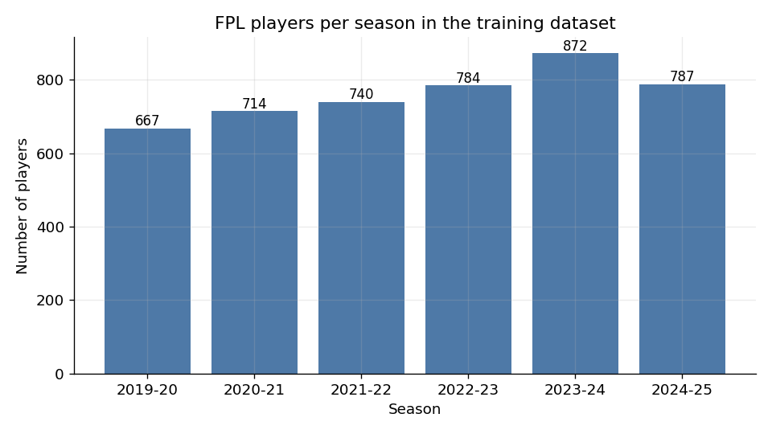

*Each bar is one season. The dataset grew from 667 player records in 2019-20 to roughly 787 in 2024-25 as more squads expanded.*

The **target** the models try to predict is the player's `total_points` for the upcoming season. Across all seasons the distribution is heavily skewed: most players accumulate fewer than 30 points (they barely play), while a small number of elite players push past 200. The median season total is 23 points and the 90th percentile is 115. The maximum in the dataset is 344 points.

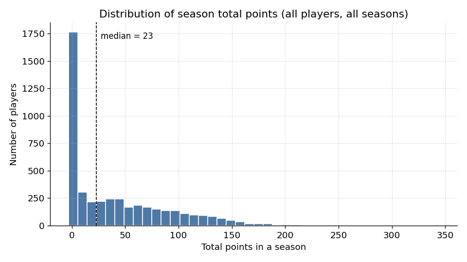

*The shape of the chart explains a lot of the difficulty: there is a long tail of high scorers and a thick wall of low-minute players. A model that simply guesses the average would be wildly wrong at both ends.*

Splitting the same data by position makes the case for position-specific models. Forwards and midfielders have the widest spread; goalkeepers cluster near zero with a small group of clean-sheet specialists above 150.

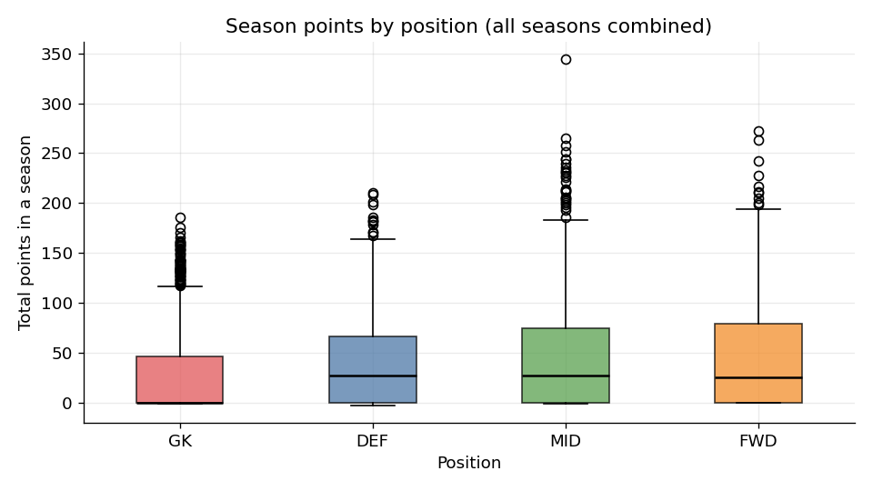

*Boxplot. The thick line in each box is the median, the box itself spans the middle half of players, and the dots above are unusually high-scoring players.*

The **features** (the columns the model uses to make its prediction) fall into three groups:

- **Current price** — `price_now`. The market itself encodes a lot of expectation; expensive players tend to score more.
- **Lagged stats** — last season's, two seasons' and three seasons' worth of points, minutes, goals, assists, clean sheets, bonus points, the FPL creativity / influence / threat indices, and a handful of disciplinary stats (yellow/red cards, own goals, penalties saved). We label these `1_years_past_X`, `2_years_past_X`, `3_years_past_X`.
- **Momentum** — derived columns such as `momentum_total_points = last_year - two_years_ago`. These tell the model whether a player is trending up or down rather than just looking at a single snapshot.

The full per-position feature list lives in `training/selected_features.json`. Each position uses a different subset of these columns, picked during hyperparameter tuning by removing features that did not improve the held-out error (a procedure called **permutation importance**: shuffle one feature at a time and see whether the model gets worse — if it doesn't, drop the feature). The final feature counts ended up at 71 for goalkeepers, 14 for defenders, 49 for midfielders, and 71 for forwards.

---

## 3. How the model is built

For each of the four positions we trained several candidate algorithms and kept the one that performed best on a held-out season. The winners were:

| Position | Algorithm chosen | Number of features |
|----------|------------------|---------------------|
| Goalkeeper | XGBoost (gradient-boosted decision trees) | 71 |
| Defender | ElasticNet (regularised linear regression) | 14 |
| Midfielder | Ridge regression (regularised linear regression) | 49 |
| Forward | LightGBM (gradient-boosted decision trees) | 71 |

Two of the four models are **tree-based** and two are **linear**. They sound very different but the intuition is the same:

> Imagine asking a hundred different football experts to predict a player's season points. Each expert is allowed to look at the same statistics but pays attention to slightly different combinations — one watches creativity and minutes, another watches price and clean sheets. We then average everyone's prediction. That collective answer is usually much closer to the truth than any single expert's. **Tree-based models** (XGBoost and LightGBM) work exactly this way — they build hundreds of small decision trees that ask yes/no questions about each statistic and combine their votes. **Linear models** (Ridge and ElasticNet) instead learn one weight per statistic: how much each extra unit of, say, `last_year_minutes` should add to or subtract from the predicted points. The two families lean on different strengths, which is why different families won different positions.

We use a **separate model for each position** because a striker scoring 200 points is normal but a goalkeeper scoring 200 is not, and the statistics that drive each are different too. A single model would have to compromise; four small specialists do better.

### Train / test split

The data is split by season so the model can never accidentally peek at the future. Seasons 2019-20 through 2021-22 are the **training set** — the data the model studies. Season 2022-23 is the **test set** the tuning script used to pick hyperparameters. Season 2023-24 is a "**holdout**" season the tuning script never opened. For this report, we evaluate the saved models on the **2024-25 season**, which was added to the dataset after the models were trained and was not used for training, hyperparameter selection, or feature pruning. This is as honest a test as we can run on this dataset: it asks "given everything the models knew at the time of training, how well do they predict a season they had not seen?"

> **Why this matters in plain language.** It would be very easy to make a model that looks brilliant on the data it was trained on — it can simply memorise the answers. The real question is whether it learns *patterns* that hold up on new players in a new season. We hide a season, ask the model to predict it, and then check the answers against what really happened.

---

## 4. Performance

Two metrics tell most of the story.

- **MAE (Mean Absolute Error)** — the average gap, in points, between what the model predicted and what really happened. Lower is better. An MAE of 25 means the model is on average 25 points away from the truth across a 38-game season.
- **R² (R-squared)** — how much of the variation between players the model captures, on a 0-to-1 scale. Higher is better. R² of 0.5 means the model explains half of the differences between players; the rest is shocks the model cannot see (injuries, manager changes, hot streaks).

The table below shows both metrics on the 2024-25 held-out season.

| Position | Algorithm | Players evaluated | MAE | RMSE | R² |
|----------|-----------|-------------------|-----|------|-----|
| Goalkeeper | XGBoost | 82 | **17.04** | 24.38 | **0.73** |
| Defender | ElasticNet | 271 | **23.49** | 29.22 | **0.48** |
| Midfielder | Ridge | 347 | **27.65** | 36.90 | **0.48** |
| Forward | LightGBM | 87 | **31.03** | 42.98 | **0.47** |

The headline reading: goalkeepers are by far the easiest to predict (lowest MAE, highest R²) because their points are driven by a small number of repeatable events (clean sheets, saves) and minutes are very stable — backups stay backups. Forwards are the hardest, because a striker's season-points total is dominated by goals, and goals are streaky: ten extra finishes one season can move a player by 60 points in a way no historical statistic foresaw.

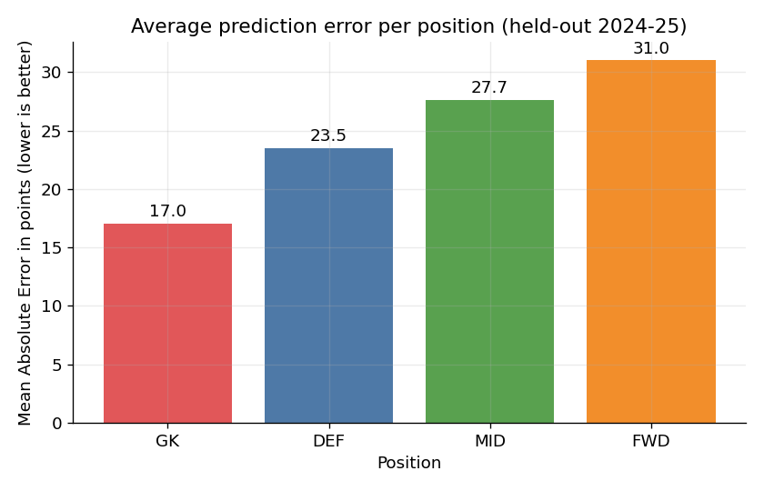

*Average error in points per player. The bar height is the typical mistake the model makes on a single player over a 38-game season.*

The scatter plots below give a more honest visual feel for the same numbers. Every dot is one player; the dashed diagonal is the line a perfect model would lie on.

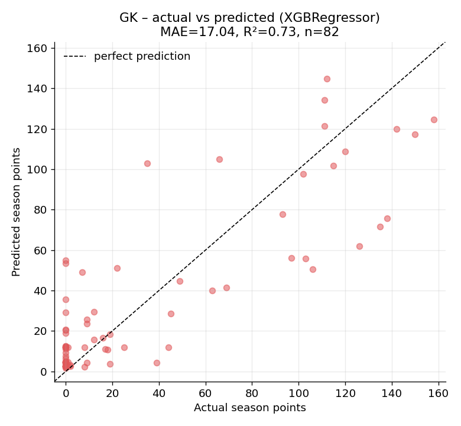

*Goalkeepers. Points cluster tightly along the diagonal — the model gets most of them right and the high-scoring goalkeepers (top-right) are clearly identified as such.*

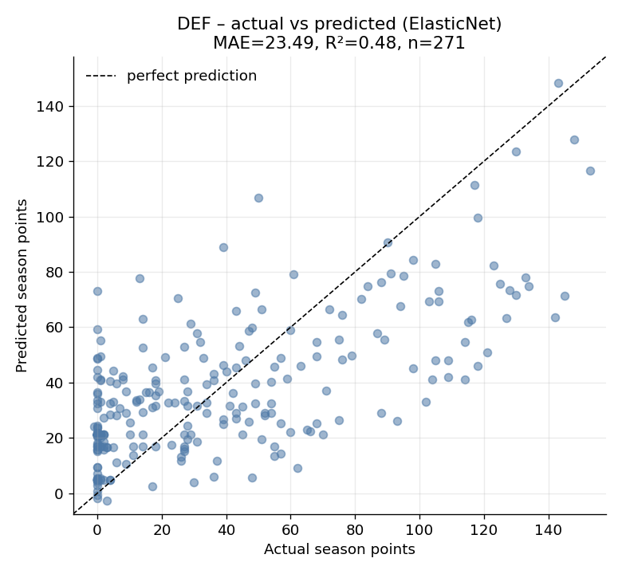

*Defenders. The middle of the pack predicts well, but the model underestimates a handful of breakout defenders that scored above 180 — these are usually attacking full-backs the model could not foresee.*

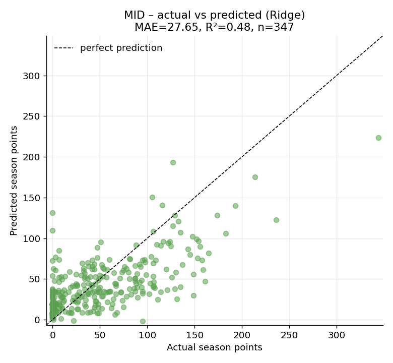

*Midfielders. Predictions track actual points but with more scatter than defenders, and the model is conservative at the top — it rarely predicts above 200 even when a player ended up there.*

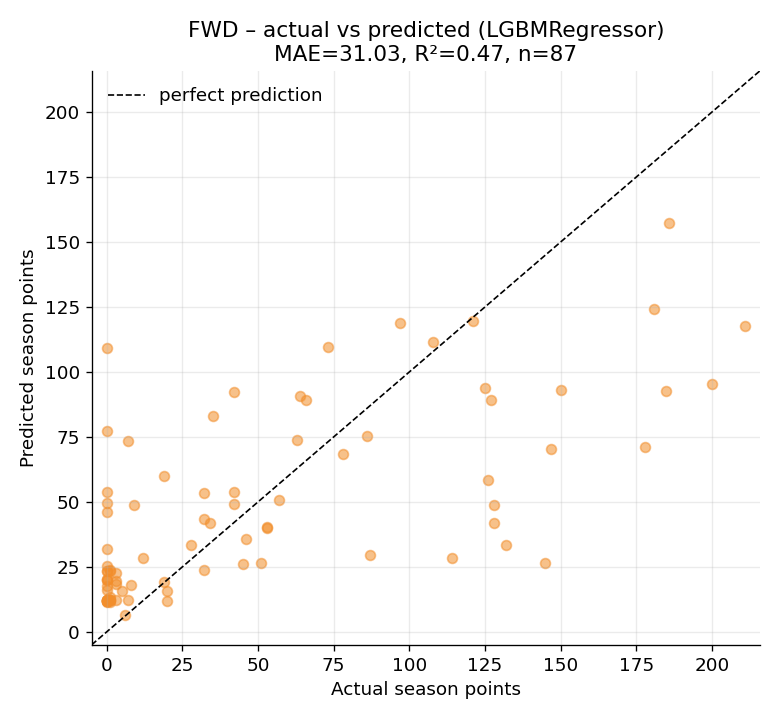

*Forwards. The widest spread of all. A few forwards scored 250+ that the model only predicted at around 150, which is the single largest source of the high MAE in this group.*

The combined error chart below shows the same story from a different angle — most predictions are within ±25 points of the truth, the distribution is centred close to zero, and there is no strong systematic over- or under-prediction. The long tails on either side are the breakouts and the disappointments that nobody could have predicted from past statistics alone.

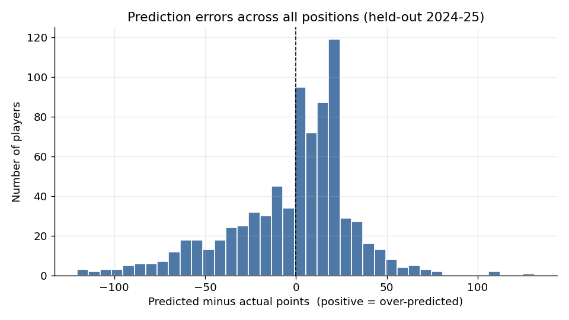

### Which statistics matter most

Each model can tell us which statistics it leaned on. For tree-based models (GK, FWD) the chart shows the "feature importance" — how often and how usefully each statistic was used in the decision trees. For linear models (DEF, MID) the chart shows the absolute value of the coefficient — how strongly each statistic pushes the prediction up or down.

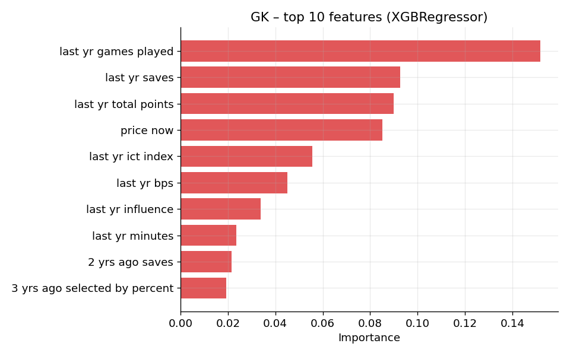

*Goalkeepers — the model leans heavily on the previous season's bonus points (BPS), saves, and minutes played. These are the stats a backup goalkeeper cannot fake.*

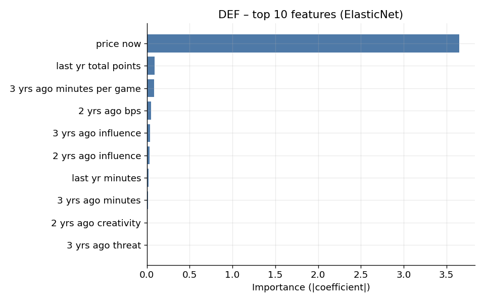

*Defenders — last season's `total_points` and minutes dominate, with some weight on three-year creativity (a proxy for whether the player joins attacks).*

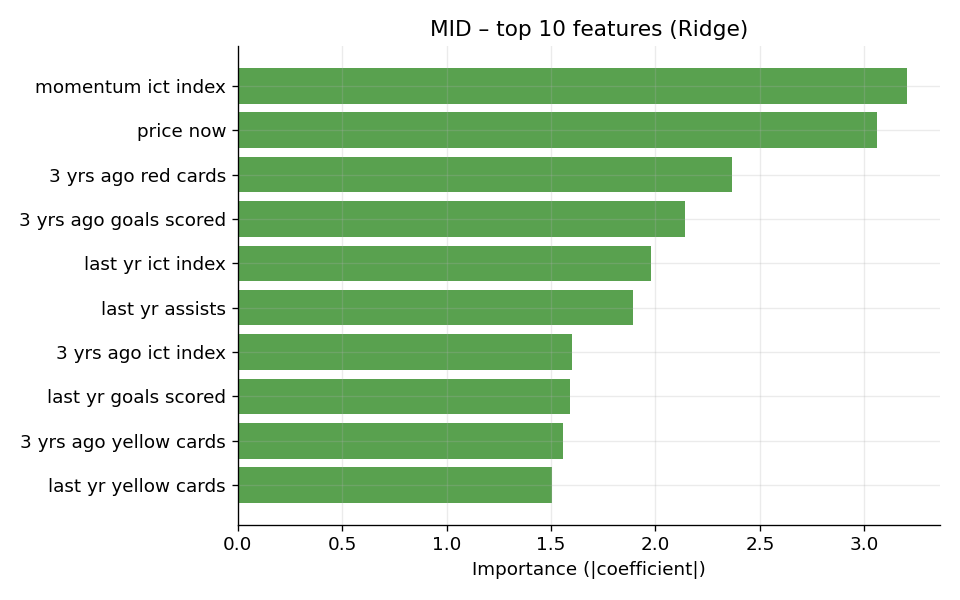

*Midfielders — bonus points (BPS) and goals two seasons ago feature strongly. The model is essentially saying "midfielders who collected a lot of bonus historically tend to keep doing so".*

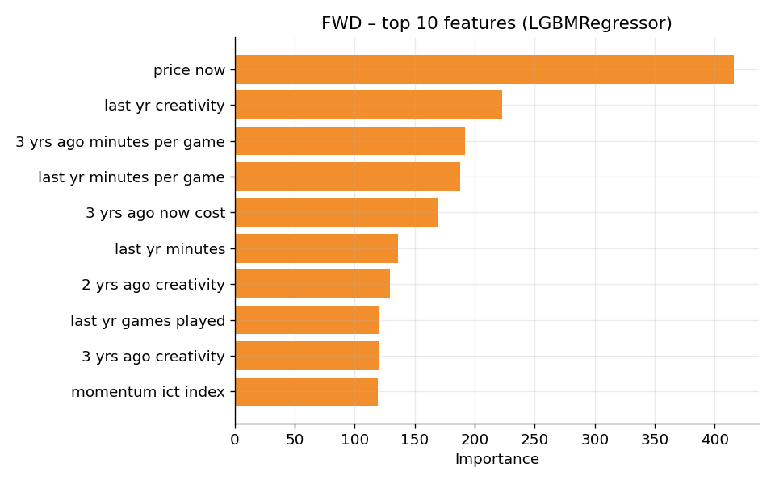

*Forwards — current price and last season's bonus points are the two largest single drivers. Price is acting as a proxy for the market's own expectation, which is itself informed by recent form and transfer-window moves.*

### Sanity check: do we beat the naive baselines?

To make sure the model is doing something real and not just learning to repeat last year's table, we compared it against two trivial baselines on the same 2024-25 season:

- **Baseline A — "last season's points":** assume each player scores exactly what they scored last year.
- **Baseline B — "position average":** assume every player at a position scores the historical position average.

| Position | Model MAE | Last-season MAE | Position-average MAE |
|----------|-----------|------------------|------------------------|
| Goalkeeper | **17.04** | 22.65 | 39.09 |
| Defender | **23.49** | 29.49 | 34.69 |
| Midfielder | **27.65** | 30.39 | 40.40 |
| Forward | 31.03 | **30.46** | 48.50 |

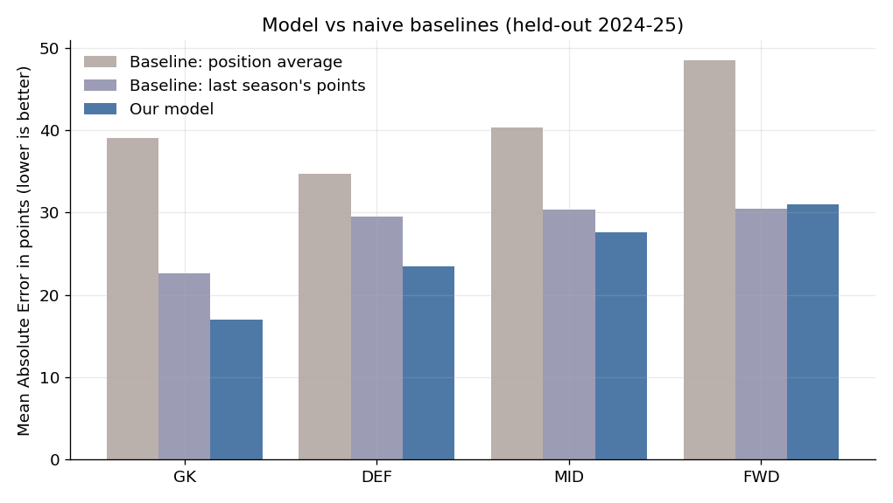

The model clearly outperforms both naive baselines for goalkeepers, defenders and midfielders. For forwards the trained model is essentially tied with "use last season's points" (31.03 vs 30.46). This is an honest finding: forward output is so dominated by goal-scoring streaks that historical statistics carry less signal than for the other positions. The model still has the advantage of correctly ranking new and price-changed players, but at the level of raw MAE it does not yet beat the naive copy-the-last-season baseline for strikers — a clear pointer to where the model can next be improved.

---

## 5. Honest limitations

Season-level fantasy points are harder to predict than they look. Three honest limitations are worth naming:

- **The model cannot see shocks.** Injuries, mid-season transfers, manager changes and red cards have a large effect on a player's final tally and none of them are knowable in August. The residual histogram's long tails are almost entirely shocks of this kind.
- **Promoted teams and new signings have weaker predictions.** When a player has no Premier League history or has just moved clubs, the lagged-statistics features are either missing (filled with zeros) or describe a different league. The model is most confident on stable, long-tenured players.
- **Season-total prediction is intrinsically noisier than weekly prediction.** Over 38 games there is more time for chance to play out — a striker who has six unlucky games in a row may finish 40 points below where the same skill level would have placed them. The companion weekly model (used for UC2) has a much narrower error in part because it only has to look one game ahead.

We do not claim the model picks the perfect team every season. We claim it picks a defensible team — one that beats trivial heuristics on three of the four positions and is honest about the fourth.

---

## 6. How this connects to the rest of the system

The model's predicted season total for every available player is the input to the **squad optimizer** in `src/team_builder.py`. The optimizer is an Integer Linear Program — in plain language, it tries every legal combination of fifteen players (within the £100m budget, with the right number of goalkeepers, defenders, midfielders and forwards, and with no more than three players from the same club) and returns the combination whose predicted points add up to the highest total. Because the search space is enormous, we use Google's OR-Tools SCIP/CBC solver to do this in well under a second. The resulting squad is the one the user sees on the Squad Builder page of the web app, alongside short explanations describing why each headline player was selected.

In short: this model decides *what each player is worth*; the optimizer decides *which fifteen of them fit together*.

---

## 7. Summary

We trained four position-specific machine-learning models to predict a Premier League player's season fantasy points from their recent statistics and current price. Evaluated on the held-out 2024-25 season, the models achieve a mean absolute error of 17 points for goalkeepers, 23 for defenders, 28 for midfielders and 31 for forwards, and explain 73% of the variation in goalkeeper performance and roughly 48% for the outfield positions. They outperform "use last season's points" for three of four positions, with forwards remaining an honest area of future work.
